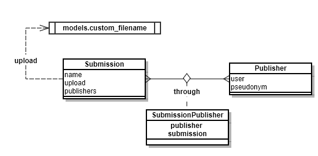

# M2M-Through

## Overview

The purpose of this project is to be able to use a through on a Many to Many table relationship.



The filename should be generated from the name of the first Publisher of the Submission.

I can't seem to get this to work.  So this project is an attempt to solve this problem.

## Settings

The ```settings.py``` file includes a ```secrets.py``` file that is ```.gitignore```d.  You will have to create this file before using ```manage.py```.  

The ```secrets.py``` file should contain your security key and allowed hosts array.

Example:
```
SECRET_KEY = 'uh!b7f@9fg_41zibb&0c4ae3fo8$t0ml0or8kp#4pp_9#3z2d_'
DEBUG = True
ALLOWED_HOSTS = ['127.0.0.1']
```

